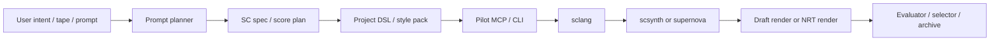
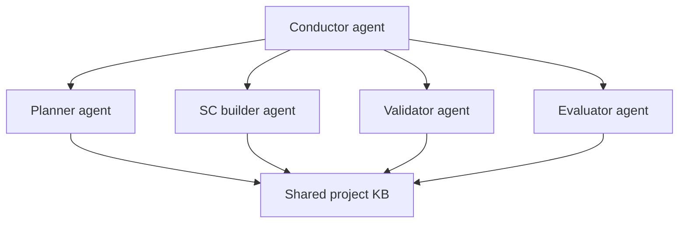

# Zhou Yi / SuperCollider Agent Assessment

[English](zhouyi-supercollider-agent-assessment.md) | [简体中文](zhouyi-supercollider-agent-assessment.zh-CN.md)

Date: 2026-06-13
Repo: `supercollider-pilot`
Audience: internal

## 1. Bottom line

Yes, this is still implementable.

But not by taking the external feedback literally as one big stack.

It also should not be framed as an overly linear engineering process:

```text
ask a few questions
-> settle the parameters / primitives quickly
-> then enter implementation
```

That model does not fit this project.

For Zhou Yi, the more realistic assumption is:

```text
the artistic language will evolve slowly,
primitives and parameters will stay unsettled for a long time,
and the system must remain useful under that condition.
```

The right move is:

```text
keep Pilot thin
+ add a small project DSL / style pack
+ add prompt-planning that targets SuperCollider, not Python audio
+ add a stronger render + validation loop
+ add multi-agent only above that, not inside the driver
```

For Zhou Yi, this is worth doing because the project is not just "make nice music." It needs a controllable mathematical and structural sound system that also supports long-term artistic refinement. SuperCollider is a good fit for that. The current repo is already a strong base for the driver layer.

## 1.5 The problem must be split correctly

This is not one problem. It is two core problems.

### Problem A: is the Pilot / MCP / CLI / harness itself good enough?

Meaning:

- is the steering layer stable
- is it usable by agents
- does it expose logs, render, status, and recovery clearly
- can it support repeated long-term experimentation instead of one-off demos

This is the **tool-body** problem.

### Problem B: can process design, skills, memory, and MCP discipline make agents call it correctly over time?

Meaning:

- will the agent bypass Pilot
- will it drift back to Python audio generation
- will it claim tool usage without actually using the tool path
- will it degrade as context drifts over time

This is the **long-term calling-discipline** problem.

The formation of parameters, primitives, and artistic language should be treated as a later emergent result of repeated usage, archive growth, and review, not as an early prerequisite that can be locked quickly.

## 2. What the current repo already is

The repo already has the correct core boundary:

```text
Agent -> MCP / CLI -> sclang -> scsynth / supernova
```

It is already a local, single-session, structured driver with:

- explicit state
- structured results
- logs
- run-file / eval
- recovery actions
- draft render flow

As of this checkout, the TypeScript + JS code under `src/` and `tests/` is about `2647` lines total.

That matters because it means you are not starting from zero. You already have the hard part of the control contract. What you do **not** have yet is the project-specific composition layer.

## 3. Where the external feedback is right

These parts are directionally correct:

1. SuperCollider's client/server split is valuable.
2. Patterns are a real advantage for algorithmic composition.
3. A DSL can reduce agent hallucination and improve controllability.
4. NRT rendering matters if output quality is the priority.
5. Error-loop repair from real logs is essential.
6. sc3-plugins and FluCoMa are meaningful ecosystem pieces.

## 4. Where the external feedback is wrong or overstated

### 4.1 `supernova` is not mandatory on day 1

`supernova` helps when your node graph is actually parallelizable through `ParGroup`. It is not a magic quality switch.

Official docs are explicit: parallel groups matter when nodes do not depend on each other, and `supernova` can distribute those groups across CPUs. That is a performance tool, not a composition strategy.

For Zhou Yi phase 1, forcing `supernova` everywhere is unnecessary complexity.

### 4.2 "64-bit double-precision audio buffers everywhere" is not accurate

This is the biggest technical exaggeration in the feedback.

Official docs say:

- server buffers are globally available arrays of **32-bit floating-point numbers**
- `Signal` is a `FloatArray`
- output files in NRT can be written as `float` or `double`

So the accurate statement is:

```text
SuperCollider can render double-format output files in NRT,
but its buffers are not simply "run the whole engine in 64-bit audio buffers."
```

That matters because you should not build the whole architecture around a false precision story.

### 4.3 MCP + memory + skills do not by themselves enforce route adherence

This is also critical.

Agent memory and instruction files help shape behavior, but they are not hard enforcement. If you truly need to stop an agent from falling back to Python audio generation or random side paths, you need:

- tool boundaries
- pre-tool checks / hooks
- artifact contracts
- validation gates
- output review

Skills are necessary. Skills are not sufficient.

### 4.4 DAW / VST integration is not in scope now

For this repo and this project phase, DAW bridges, VST hosting, live routing, and commercial mastering chains are distractions.

They may become useful later, but they do not improve the core text-to-audio loop enough to justify the added surface now.

## 5. What actually raises music quality

For your use case, quality gains do **not** come equally from every layer.

### High impact

1. Better sound primitives and SynthDefs
2. Better project-specific musical grammar
3. Better offline render path
4. Better error repair loop
5. Better evaluation / selection loop

### Medium impact

1. A small DSL that encodes Zhou Yi-specific structure
2. A prompt planner that outputs constrained SC specs before code
3. A curated subset of plugins / libraries

### Low impact

1. Multi-agent by itself
2. `supernova` by default
3. memory systems by themselves
4. DAW / VST / live-coding extras

So if the question is "what gives the biggest boost to sound quality," the answer is:

```text
domain primitives + render quality + evaluation loop
```

not

```text
multi-agent + more infrastructure words
```

## 6. Recommended architecture



### Layer meanings

#### Layer 1. Pilot core

Keep this repo focused on:

- session lifecycle
- code execution
- logs
- render
- recovery

Do not turn Pilot into a composition framework.

#### Layer 2. Zhou Yi style pack / micro-DSL

This is where quality starts to become project-specific.

Examples of what belongs here:

- hexagram-driven interval fields
- density envelopes
- transformation operators
- event family templates
- ritual-scale timing structures
- timbral families for line change / mutation / return

This should be small and compositional, not a giant fake language.

#### Layer 3. Prompt planner

The planner should not jump straight from prose to raw SC code.

It should produce a constrained intermediate spec such as:

```yaml
form:
  duration_sec: 240
  sections: [emergence, tension, mutation, release]
pitch_field:
  model: hexagram_derived
rhythm_field:
  model: asymmetrical_event_stream
timbre_family:
  model: breath_metal_noise_string
render:
  mode: draft_rt | nrt
```

That step is what makes "lightweight DSL + prompt planning" viable.

#### Layer 4. Render path

Current repo render is a realtime draft record flow.

For final quality, you should add a true NRT path later:

- build score
- call `recordNRT`
- render as file
- no interactive dependency while rendering

#### Layer 5. Evaluation loop

Without this, the agent will still produce plausible junk.

The evaluator should score:

- render success
- structural compliance
- silence / clipping / runaway detection
- section balance
- timbral target fit
- project-specific Zhou Yi rubric

## 7. How much new code this adds

If you stay lightweight, the increase is meaningful but controlled.

| Area | Estimated new code |
|---|---:|
| Prompt planner + SC spec schema | 250-500 LOC |
| Zhou Yi micro-DSL / style pack (`.scd` / Quark-like layer) | 300-900 LOC |
| True NRT render support in Pilot | 200-450 LOC |
| Evaluation harness + selection logic | 250-600 LOC |
| Agent skills / guardrails / prompts / config | 150-350 LOC |
| **Total realistic lightweight phase** | **1150-2800 LOC** |

That is roughly:

- about `0.4x` to `1.1x` the current codebase size
- but mostly in **new layers**, not by bloating the core driver

If you do full multi-agent + shared memory + orchestration now, add another:

```text
800-2000+ LOC
```

and much more operational complexity.

## 8. How much more complex the architecture becomes

If done correctly, complexity increases by **one layer**, not by turning the whole repo upside down.

### Acceptable complexity

```text
Pilot core
+ SC style pack
+ prompt planner
+ evaluator
```

### Too much complexity too early

```text
Pilot core
+ multi-agent router
+ shared KB
+ long-term memory
+ plugin registry
+ FluCoMa workflows
+ supernova tuning
+ DAW bridge
+ VST hosting
+ live coding layer
```

The second path will slow you down and make quality worse in practice, because the agent will have too many degrees of freedom before the musical language is stable.

## 9. Does multi-agent give the biggest performance boost?

No, not for sound quality.

Yes, potentially, for **workflow discipline**.

This distinction matters.

### Multi-agent helps with

- context separation
- role specialization
- preventing one huge prompt from doing everything badly
- structured review before render acceptance

### Multi-agent does not automatically help with

- better timbre
- better composition
- better SC code
- better render quality

So the ROI answer is:

```text
multi-agent is phase-2 governance infrastructure,
not phase-1 sound-quality infrastructure
```

## 10. Do you still need a multi-agent perspective?

Yes, but in two different senses.

### Sense A: multi-agent perspective for assessment

Yes. Very useful now.

You should evaluate the system from at least these roles:

- composer
- SC engineer
- render operator
- evaluator
- archivist / memory keeper

### Sense B: multi-agent runtime architecture

Later, yes. But keep it small.

Recommended eventual shape:



Do **not** start with 8-12 agents. Start with 3-4 roles maximum.

## 11. Do you need shared KB / shared memory?

Yes, but small and explicit.

Not a giant memory lake.

The shared KB should hold:

- Zhou Yi project rules
- allowed SC primitives
- forbidden patterns
- style pack docs
- render checklist
- evaluation rubric
- known-good patches
- known-failure signatures

That is enough to make subagents consistent.

## 12. Skills design: what actually matters

If you want the agent to truly use the SC route, skills must be tied to system behavior.

Recommended skill set:

### `SC-Architecture-Master`

- knows client/server split
- knows Group / Bus / Buffer / order-of-execution
- chooses `scsynth` vs `supernova` intentionally

### `Pattern-Logic-Composer`

- uses `Pbind`, `Pseq`, `Pwhite`, `Ppar`, event patterns
- treats rhythm and pitch as compositional fields, not hard-coded note lists

### `ZhouYi-Mapping-Designer`

- maps project concepts into interval, density, mutation, and form rules
- does not write decorative "eastern" presets

### `SC-Error-Healer`

- reads real post window / log output
- repairs code from actual errors
- does not invent nonexistent UGens

### `NRT-Render-Operator`

- generates score-oriented render path when quality matters
- chooses draft realtime render only for iteration

### `Audio-QA-Critic`

- checks output against rubric
- rejects structurally wrong but technically valid renders

## 13. How to guarantee quality with a lightweight DSL + planner

This is the key design question.

Quality is guaranteed by **constraining the route**, not by making the DSL huge.

### Required controls

1. Planner must emit a structured SC spec before code.
2. Code generator must target only allowed DSL primitives + approved SC patterns.
3. Pilot must be the only execution path for audio generation.
4. Logs must flow back into the repair loop.
5. Render output must go through QA checks.
6. Accepted outputs must be archived as exemplars.

### Hard enforcement ideas

If the surrounding agent platform supports it, use guardrails that:

- deny non-approved audio generation tools
- deny raw Python audio synthesis for this workflow
- require `sc_run_file` / `sc_render` or equivalent Pilot path
- inject project rules before tool calls

Instruction files alone are not enough for this.

## 14. Existing libraries: use now vs reference vs avoid now

### Use now

#### 1. Core Patterns library

Use immediately.

Why:

- native
- stable
- central to algorithmic composition
- low extra complexity
- directly useful for Zhou Yi structures

#### 2. Core NRT / `Score.recordNRT`

Use in the roadmap now, implement after draft render stabilization.

Why:

- directly improves final render path
- fits text-to-audio
- no DAW dependency

#### 3. Small project DSL on top of native SC

Use now.

Why:

- best quality/complexity ratio
- reduces hallucination
- keeps project math explicit

#### 4. Selected `sc3-plugins`

Use carefully, only for specific missing UGens.

Why:

- real sonic range expansion
- but stability is lower than core SC

Rule:

```text
add plugin by need, not by ideology
```

### Reference only

#### 1. JITLib / ProxySpace / NodeProxy

Reference heavily, do not make it core yet.

Why:

- excellent for runtime replacement and live evolution
- but your current focus is text-to-audio quality, not live coding

#### 2. ClaudeCollider

Reference architecture and skills only.

Why:

- useful proof that SC + MCP + DSL can work
- but it is more live-coding-oriented than your present target

#### 3. FluCoMa

Reference now, integrate later.

Why:

- strong for corpus work, clustering, feature-driven navigation
- but it adds conceptual and installation weight
- likely phase 3 after the base sound language is stable

### Do not touch now

#### 1. ReaCollider

Out of scope now.

#### 2. VSTPlugin / commercial plugin hosting

Out of scope now.

#### 3. Large shared-memory multi-agent infrastructure

Do not build first.

#### 4. realtime recording / DAW sync / performance tooling

Do not build first.

## 15. Recommended phased plan

### Phase 1. Lock the route

- keep Pilot as driver
- add SC spec schema
- add Zhou Yi micro-DSL
- add constrained skills
- add quality rubric

### Phase 2. Raise output quality

- add true NRT render
- add evaluator
- add exemplar archive
- add selective `sc3-plugins`

### Phase 3. Add orchestration

- add 3-4 role multi-agent system
- add small shared KB
- add guarded tool routing

### Phase 4. Explore advanced research features

- FluCoMa
- feature-space browsing
- corpus-driven generation

## 16. Final verdict

This is worth doing.

But the investable version is not:

```text
"build the ultimate SC mega-platform"
```

It is:

```text
"turn Pilot into a reliable execution core for a constrained,
quality-first Zhou Yi composition system"
```

That is a strong ROI move because:

1. it preserves the project's mathematical identity
2. it gives you real control instead of black-box music generation
3. it stays much lighter than a DAW-centric or VST-centric architecture
4. it can later support other projects without losing its core boundary

## 17. Source links

- SuperCollider overview: https://supercollider.github.io/
- Non-Realtime Synthesis: https://doc.sccode.org/Guides/Non-Realtime-Synthesis.html
- Order of execution / `ParGroup`: https://doc.sccode.org/Guides/Order-of-execution.html
- `Pbind` guide: https://doc.sccode.org/Tutorials/A-Practical-Guide/PG_03_What_Is_Pbind.html
- JITLib overview: https://doc.sccode.org/Overviews/JITLib.html
- `sc3-plugins`: https://supercollider.github.io/sc3-plugins/
- FluCoMa for SuperCollider: https://learn.flucoma.org/installation/sc/
- OpenAI agent building guide: https://developers.openai.com/tracks/building-agents
- Claude Code subagents: https://code.claude.com/docs/en/sub-agents
- Claude Code hooks: https://code.claude.com/docs/en/hooks
- Claude Code memory: https://code.claude.com/docs/en/memory

## 18. Bootstrapping sound primitives

This is the real chicken-and-egg issue, and it should be made explicit.

The system is not:

```text
first invent the entire music language,
then build the Pilot
```

It should be:

```text
use Pilot as the controlled lab
to iteratively grow the music language itself
```

But it also should not be understood as a fast parameter-discovery workflow.

That means the early goal is **not** "generate finished Zhou Yi pieces."
It is also not "lock the final parameter system quickly."
The early goal is:

```text
create a long-running environment where candidate sound primitives
can be discovered, tested, compared, retained, rejected, recombined,
and reinterpreted over time
```

### More accurate framing: not a one-time bootstrap, but a long-term cultivation bed

Think of:

```text
Pilot + harness + archive + memory
= a cultivation bed for the language itself
```

Its job is not to produce fast aesthetic closure.
Its job is to:

- make experiments happen inside one traceable system
- keep good experiments from getting lost
- preserve failed experiments as evidence
- let agents slowly learn what matters in this project
- promote primitives out of repeated practice, not out of abstract upfront design

### Recommended long-term primitive growth loop

1. Pick one narrow sonic question.
2. Planner writes a tiny SC spec for that question.
3. Builder generates 3-5 tiny SC probes, not full compositions.
4. Pilot runs them through `sc_eval`, `sc_run_file`, or `sc_render`.
5. Human + QA evaluate the outputs.
6. Best result is promoted into a named primitive candidate.
7. Primitive gets a parameter schema, example patch, and regression render.
8. But that candidate is not assumed final. It can later be renamed, demoted, merged, split, or discarded.
9. Repeat until a usable primitive library exists.

### Example primitive-development questions

- What kind of noise field best represents "breath" without becoming generic ambience?
- How should line mutation sound: spectral tearing, transient fracture, or pitch drift?
- What is the right density envelope for "return" or "recovery"?
- Which resonance family better matches ritual tension: metal, string, membrane, or hybrid?

### Why this solves the problem

Because Pilot is valuable **before** the final DSL exists:

- it gives a stable execution path
- it gives repeatable rendering
- it gives logs and recovery
- it gives an enforced place where primitive experiments happen

So the order is:

```text
Pilot first as long-term laboratory
primitive library second
full project DSL third
```

Not the reverse.

### Critical correction: do not assume the primitive system stabilizes quickly

This must be treated as a design constraint:

```text
the primitive system should be assumed unstable,
evolving, and under aesthetic dispute for a long time
```

So the design priority is not:

- define it perfectly once

It is:

- preserve its evolution history
- keep agents disciplined while it evolves
- make the system get better through use instead of drifting

## 19. Harness rules for route control

If the goal is to force agents to actually use SuperCollider, the harness must be opinionated.
And this is not a one-time correctness issue. It is a long-term discipline issue.

### Hard rules

1. All audio generation in this workflow goes through Pilot tools.
2. Python may be used for planning, schema work, metadata, or evaluation support, but not for primary sound generation.
3. Candidate primitives are not accepted unless they have:
   - source patch
   - rendered artifact
   - parameter description
   - short evaluation note
4. A "good idea" that was not rendered through Pilot does not count.

### Enforcement options

- expose only Pilot tools to the SC-building agent
- deny non-approved audio generation tools with pre-tool hooks
- require artifact output before allowing a task to complete
- keep primitive promotion as an explicit reviewed step

## 19.5 What memory should mean here

Memory should not mean:

```text
remember a few final parameter values
```

It should mean:

```text
remember the judgment traces left by long-term artistic work
```

Useful memory objects include:

- which patches were considered promising
- which patches were technically valid but aesthetically rejected
- which timbral families keep returning
- which primitives slowly became stable vocabulary
- which failure patterns recur
- which prompts repeatedly produce hollow results

This is closer to a long-term creative archive than to fine-tuning or a static parameter table.

## 20. Anti-stone-mountain code rules

To avoid `石山代码`, the primitive-development system should have explicit module boundaries.

### Recommended module split

- `Pilot core`
- `planner`
- `primitive registry`
- `probe generator`
- `render/eval loop`
- `skills + guardrails`

### File-size policy

- target: `300-600` LOC per file
- review at: `800` LOC
- avoid: `2000+` LOC files unless there is a very strong reason

That policy matters because this system will otherwise collapse under its own prompt-and-tool sprawl.
