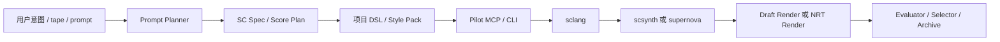
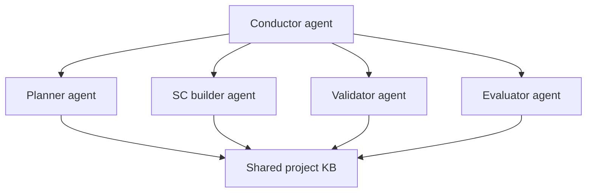

# 周易 / SuperCollider Agent 评估报告

Date: 2026-06-13  
Repo: `supercollider-pilot`  
Audience: internal

## 1. 结论先行

这个方向仍然可实现，而且值得做。

但不是照着外部那份 feedback，把所有名词一次性全堆进去。

同时，也不能把这件事理解成一种过于线性的工程流程：

```text
先问几个问题
-> 很快定下 parameters / primitives
-> 再进入工程实现
```

这对周易这种长期艺术系统不成立。

这里更准确的现实是：

```text
艺术语言会长期生长，
primitive / parameter 不会很快定型，
而系统必须在这种长期不定型的前提下仍然可用、可积累、可迭代。
```

正确方向是：

```text
保持 Pilot 很薄
+ 加一个小型项目 DSL / style pack
+ 加一个明确指向 SuperCollider 的 prompt-planning 层
+ 加一个更强的 render + validation 闭环
+ multi-agent 放在上层，不放进 driver 核心
```

对周易项目来说，这件事值得做，不是因为“做一个 generative music tool 很酷”，而是因为这个项目本身需要一个可控制、可演化、能承载数学和结构逻辑、并且允许长期审美打磨的声音系统。SuperCollider 适合做这件事，而当前 repo 已经有了一个不错的 driver 基座。

## 1.5 先把问题拆对：这是两层问题，不是一层问题

你刚才的纠正很重要。当前真正要解决的不是“怎么尽快把 sound parameters 定下来”，而是下面这两层：

### 第一层：Pilot / Co-pilot / MCP / CLI / harness 本身够不够好

也就是：

- 这个方向盘本身是不是稳定
- 它是不是容易被 agent 用
- 它是不是能提供足够清楚的状态、日志、render、recovery
- 它是不是能承载长期反复试验，而不是一次性 demo

这层解决的是：**工具体本身是否成立**。

### 第二层：流程、skills、memory、MCP 设计，能不能确保 agent 长期准确地调用它

也就是：

- agent 会不会绕开 Pilot
- 会不会偷偷回到 Python 音频生成
- 会不会只在 prompt 里说“我用了工具”，但其实没有
- 会不会随着上下文漂移，越用越偏

这层解决的是：**调用纪律和长期使用一致性是否成立**。

这两层是核心。

而 `parameter / primitive / 语言` 的形成，更像是在这两层稳定之后，通过长期使用、长期语料、长期 artifact 积累、长期 review 慢慢长出来的第三层结果，而不是一开始就能锁定的前提。

## 2. 当前仓库到底是什么

这个 repo 现在的核心边界其实是对的：

```text
Agent -> MCP / CLI -> sclang -> scsynth / supernova
```

它已经是一个本地、单 session、结构化的 SuperCollider driver，已经具备：

- 明确状态机
- 结构化结果
- 日志读取
- `run-file` / `eval`
- recovery 动作
- draft render 流程

按当前 checkout 看，`src/` 和 `tests/` 下 TypeScript + JS 代码总量大约是 `2647` 行。

这意味着你并不是从零开始。最难的“控制合同”那一层已经初步成立。现在缺的不是 driver 本身，而是**项目专属的声音语言层**。

## 3. 外部 feedback 哪些是对的

外部 feedback 里，以下判断方向上是对的：

1. SuperCollider 的 client/server 分离架构很有价值。
2. Patterns 是算法作曲里非常强的原生能力。
3. DSL 能显著减少 agent 幻觉，并提高控制性。
4. 如果你把质量放在第一位，NRT 渲染很重要。
5. 错误日志回流给 agent 做自修复是必须的。
6. `sc3-plugins` 和 FluCoMa 都是有意义的生态点。

## 4. 外部 feedback 哪些地方不准确，或者说过头了

### 4.1 `supernova` 不是 day 1 必选项

`supernova` 有价值，但它不是一个“默认一开，声音质量就上升”的开关。

官方文档讲得很清楚：只有在节点之间确实可以并行，尤其是通过 `ParGroup` 组织以后，`supernova` 才能把这些内容分到不同 CPU 上去跑。它解决的是**性能和并行调度**问题，不是“作曲质量”问题。

所以对周易 phase 1 来说，强行把 `supernova` 当成默认架构要求，复杂度会上升，但收益并不成比例。

### 4.2 “全栈 64 位双精度音频缓冲”这个说法不准确

这是外部 feedback 里最该纠正的一点。

官方资料明确说明：

- server buffer 是 **32-bit floating-point numbers**
- `Signal` 本身是 `FloatArray`
- NRT 输出文件可以写成 `float` 或 `double`

所以准确说法应该是：

```text
SuperCollider 在 NRT 输出层可以写 double 格式文件，
但不能把它简单表述成“整个音频引擎都在 64 位双精度缓冲里跑”。
```

这个区别很重要，因为如果你在一个不准确的精度叙事上建系统，后面很多工程判断都会被带偏。

### 4.3 MCP + memory + skills 本身不构成硬约束

这一点也非常关键。

memory、instruction file、skills 都能影响 agent 行为，但它们本身不是强制执行层。

如果你的目标是：

```text
确保 agent 真正走 SuperCollider / Pilot 这条路，
而不是偷偷回到 Python 音频生成或者别的捷径
```

那你真正需要的是：

- 工具边界
- pre-tool hooks
- artifact contract
- validation gate
- 输出复核机制

skills 必要，但单靠 skills 不够。

### 4.4 DAW / VST / 商业效果器现在都不该进核心范围

对这个 repo 和这个阶段来说：

- DAW 桥接
- VST 托管
- 商业混响 / 母带链
- 实时录音 / 现场联动

都不是核心问题。

它们以后可能有价值，但现在不会显著提升 text-to-audio 主循环的质量，反而会把系统边界搞得太厚。

## 5. 到底什么会真正提高音乐质量

对你这个项目来说，不是所有层都同等重要。

### 高影响

1. 更好的 sound primitives 和 SynthDefs
2. 更好的项目专属音乐语法
3. 更好的离线 render 路径
4. 更好的错误修复闭环
5. 更好的评估 / 选择闭环

### 中影响

1. 一个小而准的 DSL，把周易的结构编码进去
2. 一个先产出约束性 SC spec，再写代码的 prompt planner
3. 一个小而精选的插件 / 库子集

### 低影响

1. 仅仅“上 multi-agent”
2. 把 `supernova` 默认化
3. 仅仅做 shared memory / KB
4. DAW / VST / live-coding 延展层

所以，如果问题是：

```text
什么最能提升声音和音乐本身的质量？
```

答案不是 multi-agent，也不是再多加几个名词层。

答案是：

```text
领域 primitives + render 质量 + evaluation 闭环
```

## 6. 推荐的总架构



### 各层含义

#### Layer 1：Pilot core

这个 repo 应该继续聚焦于：

- session 生命周期
- 代码执行
- 日志
- render
- recovery

不要把 Pilot 本身膨胀成“作曲框架”。

#### Layer 2：周易 style pack / micro-DSL

这一层开始进入项目真正的声音语言。

这里应该承载的不是大而全假语言，而是小而精的项目词汇，比如：

- 基于卦象 / 爻变的 interval field
- density envelope
- transformation operator
- event family template
- ritual-scale timing structure
- 与 line change / mutation / return 对应的 timbral family

#### Layer 3：Prompt Planner

planner 不应该从 prose 直接跳到裸 SC 代码。

它应该先产出一个中间规格，例如：

```yaml
form:
  duration_sec: 240
  sections: [emergence, tension, mutation, release]
pitch_field:
  model: hexagram_derived
rhythm_field:
  model: asymmetrical_event_stream
timbre_family:
  model: breath_metal_noise_string
render:
  mode: draft_rt | nrt
```

这一步，是“轻量 DSL + prompt planning”真正可用的前提。

#### Layer 4：Render path

当前 repo 的 render 还是 realtime draft recording 路线。

如果最后追求质量，需要后续加上真正的 NRT 路径：

- build score
- 调用 `recordNRT`
- 输出文件
- 渲染时不依赖实时交互

#### Layer 5：Evaluation loop

如果没有这一层，agent 仍然会产出“看起来像样、实际上很虚”的结果。

评估层至少应该覆盖：

- render 是否成功
- 结构是否符合 spec
- 是否静音 / 爆音 / runaway
- section balance
- timbral target fit
- 周易项目自己的评价 rubric

## 7. 新增代码大概会有多少

如果保持轻量，这一轮新增是可控的，不会失控。

| 区域 | 预计新增代码 |
|---|---:|
| Prompt planner + SC spec schema | 250-500 LOC |
| Zhou Yi micro-DSL / style pack（`.scd` / Quark-like） | 300-900 LOC |
| Pilot 内真正的 NRT render 支持 | 200-450 LOC |
| Evaluation harness + selection logic | 250-600 LOC |
| Agent skills / guardrails / prompts / config | 150-350 LOC |
| **轻量阶段总计** | **1150-2800 LOC** |

这大概相当于：

- 当前仓库的 `0.4x` 到 `1.1x`
- 但大部分增长会发生在**新层**，而不是把 driver 核心塞胖

如果你现在就直接上：

- full multi-agent
- shared memory
- orchestration

那还要再长一大截，而且复杂度上升更快，收益未必成比例。

## 8. 架构会变复杂多少

如果做得对，复杂度只增加**一层**，而不是整个系统重来。

### 可接受复杂度

```text
Pilot core
+ SC style pack
+ prompt planner
+ evaluator
```

### 现在不该上的复杂度

```text
Pilot core
+ multi-agent router
+ shared KB
+ long-term memory
+ plugin registry
+ FluCoMa pipeline
+ supernova tuning
+ DAW bridge
+ VST hosting
+ live coding layer
```

后者在现在这个时间点只会让系统过早膨胀，声音语言还没稳定，就先把 agent 自由度放太大了。

## 9. multi-agent 会不会带来最大性能提升

如果你说的是**声音质量**，答案是不会。

如果你说的是**流程治理能力**，答案是可能会。

这个区分很重要。

### multi-agent 真正擅长的是

- 隔离上下文
- 分工
- 防止一个大 prompt 把所有事情混成一团
- 在 render 接受前做结构化 review

### multi-agent 不会自动带来的东西

- 更好的 timbre
- 更好的 composition
- 更好的 SC code
- 更好的 render 质量

所以 ROI 的准确说法是：

```text
multi-agent 更像 phase 2 的治理基础设施，
不是 phase 1 的声音质量基础设施
```

## 10. 那现在到底还需不需要 multi-agent 视角

需要，但要区分两层含义。

### 含义 A：现在用 multi-agent perspective 来分析系统

需要。非常有价值。

当前这件事，至少应该从这些角色来审：

- composer
- SC engineer
- render operator
- evaluator
- archivist / memory keeper

### 含义 B：最终运行时是否要做 multi-agent runtime

以后可以做，但不要一上来做很大。

推荐后期 shape：



不要一开始就做 8 个、10 个、12 个 agent。先控制在 3 到 4 个角色内。

## 11. shared KB / shared memory 要不要

要，但应该是**小而明确**的，不是一个无边无际的 memory lake。

这个 shared KB 里真正该放的是：

- 周易项目规则
- 允许使用的 SC primitives
- 禁止模式
- style pack 文档
- render checklist
- evaluation rubric
- known-good patch
- known-failure signature

这样已经足够支撑 subagent 一致性了。

## 12. skills 设计到底什么最关键

如果你真正想让 agent 走 SC 路线，而不是写一堆 Python 假装完成任务，那 skills 必须和系统行为绑在一起。

推荐 skill 集合：

### `SC-Architecture-Master`

- 理解 client/server split
- 理解 Group / Bus / Buffer / order-of-execution
- 有能力有意识地选择 `scsynth` 或 `supernova`

### `Pattern-Logic-Composer`

- 会用 `Pbind`、`Pseq`、`Pwhite`、`Ppar`
- 把 rhythm 和 pitch 当成 field，而不是硬编码 note list

### `ZhouYi-Mapping-Designer`

- 能把项目概念映射成 interval、density、mutation、form 规则
- 不会退化成表面化“东方味 preset”

### `SC-Error-Healer`

- 真正读取 post window / log
- 根据真实错误修复
- 不胡编不存在的 UGen

### `NRT-Render-Operator`

- 质量优先时走 score / NRT render
- 只有在迭代时才选择 draft realtime render

### `Audio-QA-Critic`

- 按 rubric 判断结果
- 能拒绝“技术上能跑、结构上不对”的输出

## 13. 轻量 DSL + prompt planner 的质量怎么保证

这其实就是关键设计问题。

质量不是靠把 DSL 做得很大来保证的，而是靠**约束执行路径**来保证的。

### 必须有的控制点

1. planner 必须先产出结构化 SC spec，再允许进代码阶段。
2. code generator 只能调用允许的 DSL primitive 和批准过的 SC pattern。
3. Pilot 必须是音频生成的唯一执行路径。
4. 日志必须回流到修复闭环。
5. render 输出必须进 QA。
6. 被接受的结果必须存成 exemplar。

### 硬约束建议

如果外围 agent 平台支持，应当加入：

- 拒绝未经批准的音频生成工具
- 拒绝 raw Python audio synthesis 作为主生成路线
- 强制要求通过 `sc_run_file` / `sc_render` 或同类 Pilot 接口
- 在 tool call 前注入项目规则

单靠 instruction file 不够。

## 14. “鸡生蛋”问题：没有 sound primitives，系统怎么帮我们把它长出来

这就是你刚才讲的最重要的问题，而且确实是对的。

但这里还要再修正一次：它不能被理解成一种很快收敛的“参数发现流程”。

问题不是：

```text
我们先把完整声音语言发明出来，
然后再做 Pilot
```

正确顺序应该是：

```text
先把 Pilot 作为一个受控实验室搭稳，
然后用它反过来生长 sound primitives
```

也就是说，早期系统目标**不是**直接生成完整的周易作品，也不是“快速定下一组最终 parameters”，而是：

```text
让系统能够长期承载
发现、测试、比较、保留、淘汰、重组、再解释
候选 primitives
```

### 更准确的理解：不是一次性 bootstrap，而是长期培养皿

这里更像是：

```text
Pilot / harness / archive / memory
= 一个长期工作的培养皿
```

这个培养皿的作用不是替你快速得出美学结论，而是：

- 让试验都发生在同一个可追踪系统里
- 让好的试验不会丢
- 让失败的试验也能留下痕迹
- 让 agent 逐步学会“这类项目里什么东西值得继续”
- 让 primitives 不是凭空定义，而是从长期实践里被提升出来

### 推荐的长期 primitive growth loop

1. 每次只问一个很窄的声音问题。
2. planner 为这个问题写一个很小的 SC spec。
3. builder 只生成 3 到 5 个很小的 probe patch，不生成完整作品。
4. 这些 probe 必须通过 Pilot 的 `sc_eval`、`sc_run_file`、`sc_render` 路径执行。
5. 人类 + QA 对结果做判断和标注。
6. 表现最好的结果被提升为一个 primitive candidate。
7. 这个 primitive candidate 继续被包装成：
   - primitive 名称
   - 参数 schema
   - 示例 patch
   - regression render
8. 但这个 candidate 不是“最终定稿”，而是进入长期库，允许未来被：
   - 重命名
   - 降级
   - 合并
   - 拆分
   - 废弃
9. 重复这个过程，逐步长出 primitive library。

### 适合用来长 primitives 的问题类型

- 哪一种 noise field 更像“气息”，而不是 generic ambient？
- line mutation 应该更像 spectral tearing、transient fracture，还是 pitch drift？
- “复归”应该对应怎样的 density envelope？
- ritual tension 更适合 metal resonance、string resonance、membrane resonance，还是 hybrid？

### 这为什么能解决鸡生蛋

因为 Pilot 的价值在 DSL 成熟之前就已经存在：

- 它提供稳定执行路径
- 它提供可重复 render
- 它提供日志和 recovery
- 它提供一个 primitive 实验必须发生的统一地点

所以顺序应该是：

```text
先有 Pilot 作为长期实验基础设施
再长 primitive library
再慢慢长出项目语言
```

而不是反过来。

### 关键修正：不要假设 primitive 会快速稳定

这一点必须说死：

```text
primitive system 在这个项目里，
默认应该被视为长期不稳定、长期演化、长期争议中的对象。
```

因此系统设计重点不应该是：

- “怎么一次把它定义对”

而应该是：

- “怎么长期保存它的演化轨迹”
- “怎么让 agent 在长期演化中不失控”
- “怎么让 system 越用越懂项目，而不是越用越飘”

## 15. Harness：如何确保 agent 真的每次都走 MCP / CLI / Pilot

这件事不能靠“希望它听话”，必须靠 harness。

而且这里不是一次性防错问题，而是长期纪律问题。

换句话说，真正要设计的是：

```text
一个能长期工作、不因为上下文漂移而变形的调用制度
```

### 基本原则

1. 这个 workflow 里的主要音频生成，必须全部走 Pilot tools。
2. Python 可以继续存在，但用途应限于：
   - planner
   - schema
   - metadata
   - evaluator 辅助
   而不是主声音生成。
3. 一个候选 primitive 如果没有：
   - source patch
   - rendered artifact
   - parameter description
   - short evaluation note
   就不算成立。
4. 一个“想法”如果没有通过 Pilot render 出来，就不算完成。

### 真正可执行的约束方式

- 对 SC builder agent 只暴露 Pilot 相关工具
- 用 PreToolUse hook 拒绝未经批准的音频生成路线
- 要求任务结束前必须产出 artifact
- primitive promotion 必须是显式 review 步骤

换句话说：

```text
skills 负责教它怎么做，
harness 负责不让它乱做，
archive / memory 负责让它长期记得什么是这个项目真正有价值的东西
```

## 15.5 长期艺术打磨下，memory 应该怎么理解

这里的 memory 不应该被理解成：

```text
记住几个参数值
```

而应该被理解成：

```text
记住长期创作过程中留下来的判断痕迹
```

真正有价值的记忆对象包括：

- 哪些 patch 曾经被认为有潜力
- 哪些 patch 虽然技术正确但审美上被否决
- 哪些 timbral family 经常被复用
- 哪些 primitive 逐渐从临时试验变成稳定词汇
- 哪些失败模式反复出现
- 哪些 prompt / 结构描述容易导向空洞结果

也就是说，这不是 fine-tuning，也不是一次性参数表，而更像：

```text
一个长期演化的创作档案系统
```

## 16. 现成库：哪些现在接、哪些只参考、哪些现在不要碰

### 现在就接

#### 1. Core Patterns library

立刻接。

原因：

- 原生
- 稳定
- 是算法音乐最核心的一层
- 复杂度低
- 对周易这种结构项目直接有用

#### 2. Core NRT / `Score.recordNRT`

路线现在就定下来，实现可以放在 draft render 稳定之后。

原因：

- 它直接提升最终 render 路径
- 非常适合 text-to-audio
- 不依赖 DAW

#### 3. 基于原生 SC 的小型项目 DSL

现在就接。

原因：

- 质量 / 复杂度比最好
- 明显减少 hallucination
- 能保持项目数学层显性化

#### 4. 选择性接入 `sc3-plugins`

谨慎使用，只在确实缺某类 UGen 时引入。

原因：

- 真实扩展声音能力
- 但官方也明确提醒：整体稳定性平均不如 core collection

规则很简单：

```text
按需要加，不按意识形态加
```

### 现在只参考

#### 1. JITLib / ProxySpace / NodeProxy

高度参考，但先不要作为系统中心。

原因：

- 对 runtime replacement / live evolution 很强
- 但你当前重心是 text-to-audio quality，不是 live coding

#### 2. ClaudeCollider

只参考架构和 skill 设计。

原因：

- 它证明了 SC + MCP + DSL 是能成立的
- 但它现在更偏 live-coding 气质，不完全等于你当前目标

#### 3. FluCoMa

现在参考，后面再集成。

原因：

- 对 corpus work、clustering、feature-driven 生成很强
- 但安装和概念成本都比较高
- 更适合 phase 3

### 现在不要碰

#### 1. ReaCollider

现在出范围。

#### 2. VSTPlugin / 商业插件托管

现在出范围。

#### 3. 大型 shared-memory multi-agent infrastructure

现在不要先做。

#### 4. 实时录音 / DAW sync / performance tooling

现在不要先做。

## 17. 如何避免石山代码

你这一点非常对，必须一开始就立规则。

### 推荐模块边界

- `Pilot core`
- `planner`
- `primitive registry`
- `probe generator`
- `render / eval loop`
- `skills + guardrails`

### 文件大小策略

- 目标：`300-600` LOC / file
- 到 `800` LOC 必须 review
- `2000+` LOC 文件原则上避免，除非有极强理由

因为这种系统一旦没有边界，最后一定会变成：

```text
prompt 逻辑一坨
工具调度一坨
primitive 注册一坨
evaluation 一坨
最后谁都不敢碰
```

## 18. 推荐分阶段路线

### Phase 1：先锁路线

- 保持 Pilot 是 driver
- 加 SC spec schema
- 加 Zhou Yi micro-DSL
- 加 skills / guardrails skeleton
- 加 primitive bootstrap loop
- 加 quality rubric

### Phase 2：提高输出质量

- 加真正的 NRT render
- 加 evaluator
- 加 exemplar archive
- 加选择性的 `sc3-plugins`

### Phase 3：加治理层

- 加 3 到 4 角色的 multi-agent
- 加小型 shared KB
- 加受控 tool routing

### Phase 4：进入高级研究层

- FluCoMa
- 特征空间导航
- corpus-driven generation

## 19. 最终判断

这件事情值得做。

但值得投的版本不是：

```text
“做一个 ultimate SuperCollider mega-platform”
```

而是：

```text
“把 Pilot 做成一个可靠执行核心，
用它来生长一个受约束、质量优先、
面向周易项目的声音语言系统”
```

这件事有 ROI，因为：

1. 它保住了项目的数学 / 结构身份
2. 它给你的是可控生成，而不是黑盒音乐
3. 它比 DAW / VST 中心架构轻得多
4. 它以后还能服务别的项目，但不会丢掉现在的边界

## 20. 主要外部依据

- SuperCollider 官方总览: https://supercollider.github.io/
- NRT: https://doc.sccode.org/Guides/Non-Realtime-Synthesis.html
- Order of execution / `ParGroup`: https://doc.sccode.org/Guides/Order-of-execution.html
- `Pbind` guide: https://doc.sccode.org/Tutorials/A-Practical-Guide/PG_03_What_Is_Pbind.html
- JITLib: https://doc.sccode.org/Overviews/JITLib.html
- `sc3-plugins`: https://supercollider.github.io/sc3-plugins/
- FluCoMa for SuperCollider: https://learn.flucoma.org/installation/sc/
- OpenAI agent building: https://developers.openai.com/tracks/building-agents
- Claude Code subagents: https://code.claude.com/docs/en/sub-agents
- Claude Code hooks: https://code.claude.com/docs/en/hooks
- Claude Code memory: https://code.claude.com/docs/en/memory
